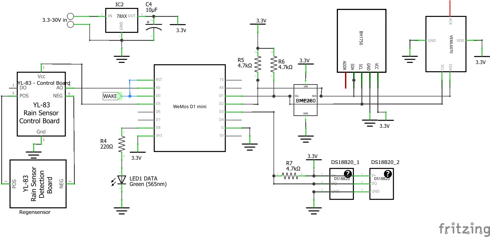
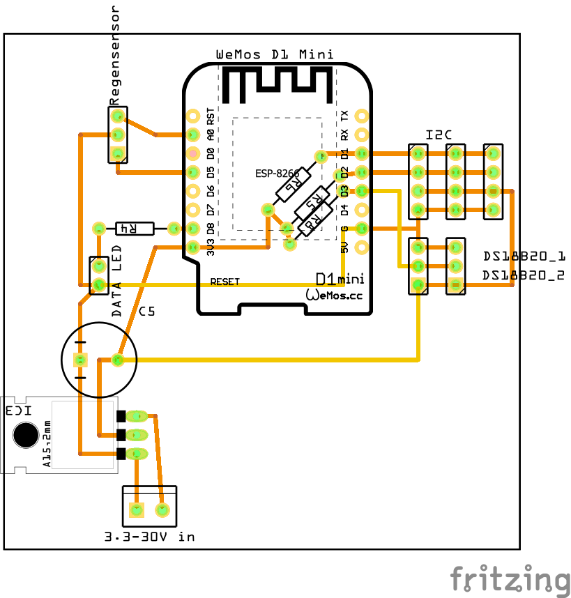

# ESP8266 MQTT Wetterstation

Wie man eine Wetterstation basierend auf einem ESP8266 baut...

Der ESP verbindet sich per WLAN mit einem MQTT-Server und sendet die Messwerte als JSON (alle 10 Minuten), welche dann in Node-Red empfangen und verarbeitet werden. Zusätzlich werden die Daten in eine Influx-DB Datenbank geschrieben und können in Grafana visualisiert werden.

Diese Wetterstation kann als Erweiterung der Bresser-Wetterstation gesehen werden. Es werden Funktionen hinzugefügt, welche über die Bresser-Wetterstation nicht gemessen und empfangen werden können.

# Die Sensoren
| Sensor	| Protocol	| Values |
| --------- |---------- | ------ |
| BME 280 | I2C | Temperatur (nicht genutzt da nicht exakt), Luftfeuchtigkeit (nicht genutzt da von Bresser-Station gemesssen), Luftdruck |
| 2x DS18B20 | OneWire Bus | Temperatur (2m und 0m Höhe) |
| BH1750 | I2C | Helligkeit |
| Rain sensor | Analog in | Regen ja/nein |
| VEML6070 | I2C | UV-Intensität (daraus kann der UV-Index berechnet werden) |

 

# Hardware
Es wird ein WeMos D1 Mini Board verwendet. Das PCB-Layout passt (nur) für dieses Board.
## Schaltplan

## Hauptplatine

## 3D gedruckte Teile
Im Internet habe ich einen sog. Stevenson-Screen gefunden, welcher als Sonnenschutz-Gehäuse für den BME280 und die DS18B20 Sensoren dient.

Für die beiden Lichtsensoren habe ich jeweils ein Gehäuse erstellt, welche z.B. mit einem Stück Plexiglas geschlossen oder für noch besseren Feuchtigkeitsschutz mit transparenten Epoxidharz ausgegossen werden können. 
Die Modelle können aus der GitHub repository heruntergeladen werden. Das Lichtsensor Gehäuse ist auch auf Tinkercad verfügbar:  https://www.tinkercad.com/things/6c97AcGgvdE 

 

# Software
## ESP8266
-	Es wird bei jeder Messung ein Mittelwert aus 3 Messungen gebildet
-	Der Luftdruck auf NN-Niveau wird berechnet. (Im Programmcode muss die Aufstellhöhe der Station angepast werden, damit dieser Wert korrekt berechnet werden kann)
-	Es sind einige Debugging-Funktionen implementiert: ESP Reset, Ping/Pong, WIFI Signalstärke
-	Debug LED
bootup: ein
nach Initialisierung: blinkt 2x
error, MQTT nicht verbunden: dauer ein
-	Damit die DS18B20 Sensoren funktionieren müssen die Sensoradressen im Code angepasst werden. Diese Adressen können mit Beispielcode `oneWireSearch.ino` der DallasTemperature Bibiliothek in Erfahrung gebracht werden.
- Alle benötigten Bibiliotheken sind im Code verlinkt und können von dort heruntergeladen werden.

Achtung: Damit die Datenübertragung mit JSON funktioniert muss die zulässige Paketgröße `MQTT_MAX_PACKET_SIZE` in der `PubSubClient.h` Datei auf `1024` erhöht werden. Diese Datei ist unter Windows zu finden unter: `C:\Users\*YOUR_USERNAME*\Documents\Arduino\libraries\pubsubclient-master\src\PubSubClient.h`

## Datenverarbeitung: Node-Red
Die Auswertung der Messwerte erfolgt in Node-Red.
Ich habe einen Flow erstellt, welcher die Werte im Node-Red Dashboard grafisch darstellt sowie in eine Influx-DB Datenbank schreibt. Somit ist eine weitere Auswertung mit Grafana möglich. In Node-Red wird ebenfalls die Berechnung des UV-Risikofaktors (UV-Index) durchgeführt. Die Messwerte werden in globale Variablen geschieben, sodass sie innerhalb von Node-Red weiterverwendet werden können (z.B. für das [MQTT Weather Display](https://github.com/dustinbrun/MQTT-Weather-display))

[Screenshot des Node-Red Flows](Node-Red/node-red-flow.PNG)

Der Flow kann aus der Github Repository heruntergeladen werden.

# Quellen
-	https://github.com/jp112sdl/HB-UNI-Sen-WEA 
-	Rain sensor:	https://www.heise.de/developer/artikel/Darf-es-etwas-mehr-sein-Anschluss-von-Umweltsensoren-3339616.html 
-	MQTT: https://randomnerdtutorials.com/esp8266-and-node-red-with-mqtt/ 
-	BME280, debug functions: https://github.com/adlerweb/ESP8266-BME280-Multi/blob/master/src/main.cpp 
-	Stevenson Screen: https://www.thingiverse.com/thing:2755149 
-	Weitere Quellen (Bibiliotheken etc.) sind im Code verlinkt

  

This work by Dustin Brunner is licensed under <a rel="license" href="https://creativecommons.org/licenses/by/4.0">CC BY 4.0</a>

 Dieses Werk von Dustin Brunner ist lizenziert unter einer <a rel="license" href="http://creativecommons.org/licenses/by/4.0/">Creative Commons Namensnennung 4.0 International Lizenz</a>.

