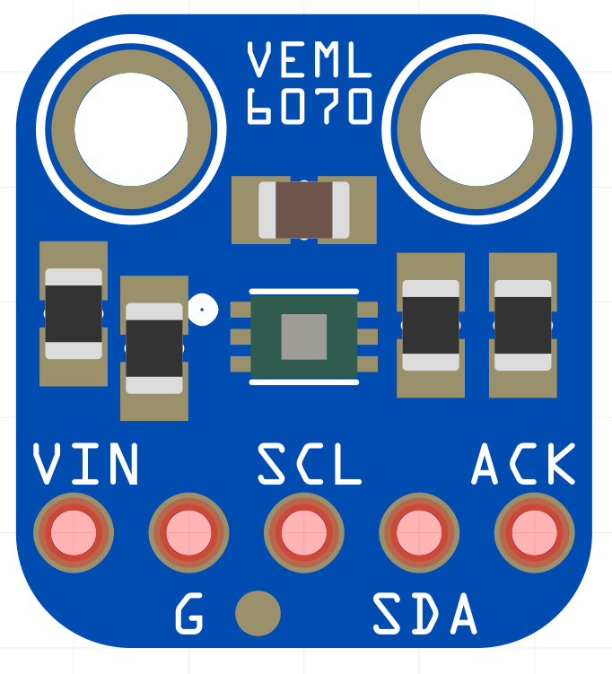

# VEML6070 UV Sensor

[](VEML_6070.png)

The VEML6070 is a UV sensor with I2C-Interface.
It measures the UV light level but **NOT** the UV-Index. However, it is possible to convert the sensor readings to an equivalent UV-risk level/UV-Index.

> Unlike the Si1145 (http://adafru.it/1777), this sensor will not give you UV Index readings. However, the Si1145 does UV Index approximations based on light level not true UV sensing. The VEML6070 in contrast does have a real light sensor in the UV spectrum.

## Using the Sensor with Arduino
The sensor can be easily connected to the I2C pins of the Arduino (for Arduino UNO + Nano these are the pins A4 and A5).

To read the measurements the `Adafruit_VEML6070`-Library can be used. 
It can be installed directly via the Arduino Library Manager. Alternatively, it can be downloaded from GitHub: https://github.com/adafruit/Adafruit_VEML6070


## Convert measurements to UV-Risk level
The conversion is implemented in the equivalent Adafruit library for Circuit Python  (https://github.com/adafruit/Adafruit_CircuitPython_VEML6070). However it is not implemented in the Arduino version.

I adapted the Circuit Python code and created an extended example sketch with risk-level-conversion.

```
String convert_to_risk_level(int reading) 
{
  int integration_time = 4;   //available for Integration-Time 1, 2, 4
                              // MUST be adjusted according to the set integration time
  reading = reading / integration_time;

  String risk_level;

  if(reading <= 560)
      risk_level = "LOW (UV 0-2)";
  else if(reading > 560 && reading <= 1120)
      risk_level = "Moderate (UV 3-5)";
  else if(reading > 1120 && reading <= 1494)
      risk_level = "High (UV 6-7)";
  else if(reading > 1494 && reading <= 2054)
      risk_level = "Very High (UV 8-10)";
  else if(reading > 2054 && reading <= 9999)
      risk_level = "Extreme (UV >10)";
  else
      risk_level = "ERROR";

  return risk_level;
}


```

## You can the full example sketch [here](./vemltest_extended/vemltest_extended.ino).

<br>
References/Sources: https://cdn-learn.adafruit.com/downloads/pdf/adafruit-veml6070-uv-light-sensor-breakout.pdf 