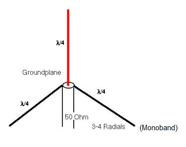

# Bresser Wetterstation MQTT
Viele Wetterstationen können mit Hilfe der Software rtl_433 emfangen werden.
rtl_433 wird hierbei als Brücke zwischen dem Signal der Wetterstation (868MHz) und dem MQTT-Server verwendet.
Ich verwende eine `Bresser 5-in-1 Wetter Center`-Station ([Link](https://www.bresser.de/Wetter-Zeit/BRESSER-5-in-1-Wetter-Center-schwarz.html)). rtl_433 ist aber ebenfalls mit vielen anderen Wettersationen kompatibel. Dazu einfach einen Blick in die Dokumentation werfen.

Der Empfang erfolgt mit Hilfe eines SDR-USB Sticks (auch ein DVBT-Stick mit RTL2832-Chipsatz ist möglich).

------------------

# Installation von rtl_433

Link zur Software: https://github.com/merbanan/rtl_433

Die Software kann z.B. auf einem Raspberry Pi oder innerhalb einer Virtuellen Maschine (VM, Ubuntu 20.04 server) erfolgen.

rtl_433 kann als Linux-Paket installiert werden (unter Debian mit `apt-get install rtl-433`). In meinem Fall konnte mit dieser Version jedoch keine erfolgreiche Decodierung erreicht werden. Deshalb der Weg über die manuelle Compillierung, welche bei mir die Wetterstation auf Anhieb erfolgreich empfangen konnte.

Zur Verwendung des SDR-Sticks zunächst folgende Vorkehrungen treffen:

In die Datei
```
sudo nano /etc/modprobe.d/blacklist.conf
```
folgende Einträge ergänzen:
```
# Blacklist DVBT-SDR Stick (disable the Stick for DVBT)
blacklist dvb_usb_rtl28xxu
blacklist rtl2832
blacklist rtl2830
```

Nun kann der SDR-Stick eingesteckt und mit der eigentlichen Installation begonnen werden. Die hier angegeben Paketversionen müssen nicht zwangsläufig verwendet werden funktionierten in meinem Fall jedoch auf Anhieb.
```
sudo apt-get install git libtool=2.4.6-14 libusb-1.0-0-dev=2:1.0.23-2build1 librtlsdr-dev=0.6.0-3 rtl-sdr=0.6.0-3 build-essential cmake pkg-config

git clone https://github.com/merbanan/rtl_433.git
cd rtl_433/
mkdir build
cd build
cmake ..
make
sudo make install
```

Die Funtkion des SDR-Sticks kann mit Hilfe des Befehls `rtl_test -t` geprüft werden.

# Testen des Empfangs
Als Antenne kann bei geringer Entfernung zur Wetterstation die dem DVBT-Stick mitgelieferte Antenne verwendet werden. 
Anderenfalls empfiehlt es sich eine `868MHz` Groundplane-Antenne zu bauen (Quelle: https://www.darc.de/fileadmin/filemounts/distrikte/o/ortsverbaende/38/Downloads/Bericht_868MHz_Antennen_V2.0.pdf):

[](pictures/Groundplane.png)
([Bildquelle](http://sites.prenninger.com/elektronik/dvb-t-antennen/groundplane))

Für die Frequenz `868MHz` beträgt die Länge eines einzelnen Drahtes `lambda/4 = 1/4 * 300/868MHz * 0.96 = 8,29cm`.

Mit der passenden Antenne kann nun ein erster Empfangstest stattfinden:

```
rtl_433 -f 868M
```
Nach wenigen Sekunden/Minuten sollte ein erfolgreicher Empfang zustande gekommen sein. Die Ausgabe zeigt die Decodierten Messwerte:
```
time      : 2021-12-30 10:05:47
model     : Bresser-6in1  id        : 27384665
channel   : 0             Battery   : 1             Temperature: 19.8 C
Humidity  : 53            Sensor type: 1            Wind Gust : 0.8 m/s
Wind Speed: 0.8 m/s       Direction : 144           Integrity : CRC
```
Es kann teilweise vorkommen, dass in einer Nachricht nicht alle Messwerte gesendet werden.
Der Empfang kann mit `STRG-C` beendet werden.

# Produktivbetrieb mit MQTT
Die Einstellungen für den Betrieb werden in einer Konfigurationsdatei festgelegt. Dafür wird zunächst die Beispieldatei in das Programmverzeichnis kopiert und anschließend geöffnet.
```
sudo mkdir /etc/rtl_433
sudo cp conf/rtl_433.example.conf /etc/rtl_433/rtl_433.conf
sudo nano /etc/rtl_433/rtl_433.conf
```
In dieser Datei folgende Zeilen auskommentieren und anpassen:
```
frequency     868M          # Empfangsfrequenz der Wetterstation
sample_rate   1000000
report_meta   time:iso      # Fomat des Zeitstempels ISO
output        mqtt://---MQTT-SERVER-IP---:1883,user=USERNAME,pass=PASSWORD,retain=0,devices=rtl_433[/protocol]       # Ausgabe mit MQTT
```
Achtung: Bei dieser Art der Konfiguration kann es vorkommen, dass auch andere Wettersationen des gleichen Typs empfangen werden, sofern sie in Reichweite des Empfängers sind. Dies kann durch einen Abgleich der `id` der eigenen Station vermieden werden. Zu beachten ist dabei jedoch, dass sich die id nach jedem Reset bzw. Batteriewechsel ändert und damit jedes mal eine erneute Konfigurationsänderung nöitg ist.

Damit nur die Eigene Wetterstation (bzw. nur Sationen des gleichen Typs wie die eigene) empfangen wird, können in der Datei alle Protokolle außer das benötigte auskommentiert (`#` vor jede Zeile) oder gelöscht werden. Die einzige benötigte Zeile für diese Wetterstation muss erhalten bleiben:
```
protocol 172 # Bresser Weather Center 6-in-1, 7-in-1 indoor, new 5-in-1, 3-in-1 wind gauge, Froggit WH6000, Ventus C8488A
```

Nun kann diese Datei gespeichert und geschlossen werden. 

Es wird zuletzt noch der automatische Start beim Hochfahren konfiguriert:
```
sudo nano /etc/systemd/system/rtl_433-mqtt.service
```
In diese Datei wird der folgende Inhalt eingefügt und gespeichert:
```
[Unit]
Description=rtl_433 to MQTT publisher
After=network.target
[Service]
ExecStart=/usr/local/bin/rtl_433
Restart=always
RestartSec=5
[Install]
WantedBy=multi-user.target
```
Nun kann der Autostart aktiviert werden:
```
sudo systemctl enable rtl_433-mqtt.service
sudo systemctl start rtl_433-mqtt.service
sudo systemctl status rtl_433-mqtt.service
```
(Eine Deaktivierung kann mit `sudo systemctl disable rtl_433-mqtt.service` erfolgen.)

rtl_433 erzeugt nun für jeden Messwert eine MQTT-Nachricht. Der Name des MQTT-Topics entspricht dabei dem Messwertname, z.B. `rtl_433/172/wind_avg_m_s` oder `rtl_433/172/temperature_C`.

# Datenverarbeitung mit Node-Red
rtl_433 erzeugt bei jeder Nachricht für jeden Messwert eine MQTT-Nachricht, welche mit Node-Red weiterverarbeitet werden kann. Ich habe einen Node-Red-Flow erstellt, welcher die Messwerte im Node-Red-Dashboard darstellt sowie in eine Influx-DB Datenbank schreibt. Somit ist auch eine Visualisierung mit Grafana möglich. In Node-Red erfolgt ebenfalls die Berechnung von Taupunkt und Hitzeindex (gefühlte Temperatur) aus den Messwerten sowie eine Umrechung der Windgeschwindigkeit in km/h und eine entsprechende Windstärke (Beaufortskala). 

[Screenshot des Node-Red-Flows](pictures/node_red_flow.png)

Der Flow (`wetter_bresser_node_red_flow.json`) kann aus der Github-Repository heruntergeladen und importiert werden. Es werden folgende Erweiterungs-Nodes benötigt: node-red-dashboard, node-red-contrib-influxdb und node-red-contrib-calculate.


<br>
<br>
<p xmlns:dct="http://purl.org/dc/terms/" xmlns:cc="http://creativecommons.org/ns#" class="license-text">This work by <span property="cc:attributionName">Dustin Brunner</span> is licensed under <a rel="license" href="https://creativecommons.org/licenses/by/4.0">CC BY 4.0</a></p>

<a rel="license" href="http://creativecommons.org/licenses/by/4.0/"></a><br />Dieses Werk von <span xmlns:cc="http://creativecommons.org/ns#" property="cc:attributionName">Dustin Brunner</span> ist lizenziert unter einer <a rel="license" href="http://creativecommons.org/licenses/by/4.0/">Creative Commons Namensnennung 4.0 International Lizenz</a>.